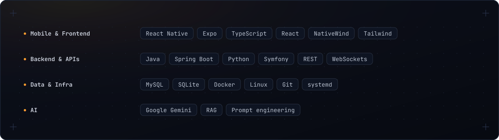
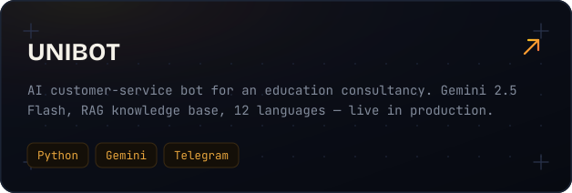
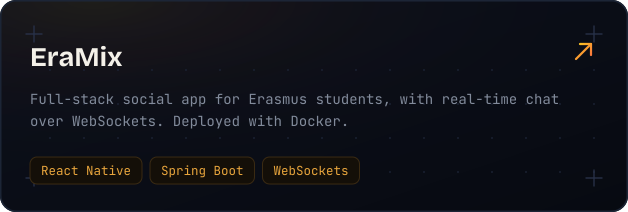
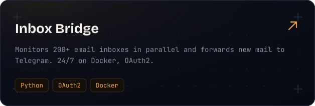
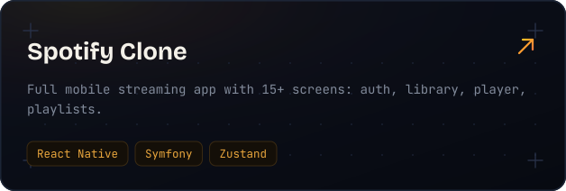

  

  <a href="https://www.linkedin.com/in/santiago-sanchez-march/">LinkedIn ↗</a>
  &nbsp;&nbsp;·&nbsp;&nbsp;
  <a href="mailto:doblesmarch@gmail.com">Email ↗</a>

 

### ▍ About

I'm a 19-year-old developer from Valencia. I just finished my Higher Vocational Diploma in Multi-Platform Application Development and three months of Erasmus+ in Warsaw, where I shipped two systems that now run in production for an international education consultancy — one of them an AI support bot powered by Google Gemini. I care about clean code, interfaces that feel right to use, and software that actually ships. Mobile is where I'm sharpest, but I'm comfortable owning a feature end to end — from the React Native screen down to the database schema. Currently looking for a junior role: remote, hybrid, or on-site in Valencia.

 

### ▍ Stack

  

 

### ▍ Selected work

  
  &nbsp;
  

  
  &nbsp;
  

 

  Spanish — Native &nbsp;·&nbsp; English — B2 &nbsp;·&nbsp; Catalan / Valencian — C1

